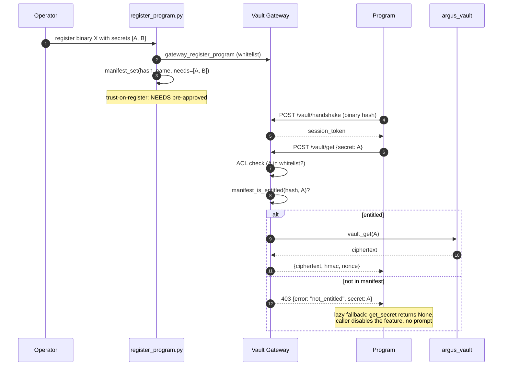

# Argus Vault Gateway

> **Status:** V2 (cross-process broker on top of `argus_vault` V1).
> Localhost-only HTTPS service that brokers encrypted secrets to
> *whitelisted programs* with live binary-hash verification, HMAC-signed
> responses, and token-bucket rate limiting.

The plain `argus_vault` module is fine for in-process Argus code, but
other programs in the suite (NetGuard, Argus browser, GeniA, third-party
modules) need a network-style broker that can authenticate them by
**binary identity** rather than by a shared passphrase or filesystem ACL.
That broker is the gateway.

---

## 1. Quick start

### 1.1 Install (no extra steps)

Already vendored. Imports come from the suite root.

### 1.2 Start the gateway

```python
import argus_vault_gateway
argus_vault_gateway.gateway_start()  # https://127.0.0.1:8769
```

On first start, a self-signed cert + private key are generated under
`argus_data/.gateway/` (gitignored). The cert's SPKI hash is also pinned
into the vault under `GATEWAY_CERT_SPKI_HASH` for client verification.

### 1.3 Register a program

```bash
python tools/register_program.py /path/to/my_program.py
```

Interactive prompts will ask you to:

1. Confirm the SHA-256 of the binary
2. List the secrets the program may read/write
3. Set permissions (`read`, `write`)
4. Pick a human label

Or non-interactively:

```bash
python tools/register_program.py ./my_app.exe \
    --yes \
    --secrets ANTHROPIC_API_KEY,GITHUB_TOKEN \
    --permissions read \
    --label "My App" \
    --rate-per-min 60 \
    --burst 10
```

### 1.4 Use it from your program

```python
from argus_vault_client import VaultClient

with VaultClient() as v:
    api_key = v.get("ANTHROPIC_API_KEY")
    # call the API
    # session auto-closed on exit
```

---

## 2. Architecture

```
program A (NetGuard)        program B (Argus)        program C (GeniA)
       \                          |                        /
        \                         |                       /
         POST /vault/get with Bearer <session_token>
                          |
                          v
              argus_vault_gateway.py (127.0.0.1:8769, HTTPS)
                          |
            1. Live re-hash caller via psutil
            2. Whitelist + ACL check
            3. Token-bucket rate-limit
            4. argus_vault.vault_get
            5. Encrypt + HMAC response
            6. Append audit chain entry
                          |
                          v
                    argus_vault.py (V1 storage)
                    argus_data/.vault/secrets.enc
```

---

## 3. Security model

### 3.1 What the gateway protects against

* **Identity spoofing on the same box.** A sibling process pretending to
  be NetGuard. The gateway looks up the source-port -> PID -> exe path
  and re-hashes the on-disk binary live; mismatch -> 403.
* **Loopback sniffing.** TLS even on `127.0.0.1`, with SPKI pinning so
  the client refuses TOFU-on-rotate without operator action.
* **Replay.** Each request carries a fresh nonce that the response HMAC
  commits to. A captured response cannot be replayed against a new
  request.
* **Long-running compromise.** Sessions expire after 5 minutes;
  rate limits cap the blast radius if a session is ever stolen.
* **Audit tampering.** The audit log is an HMAC-SHA256 chain anchored
  at a per-machine fallback key (or a vault-stored key when present).
  `gateway_audit_chain_verify()` walks the chain and returns False on
  any single byte mutation.

### 3.2 What the gateway does NOT protect against

Be honest with yourself about these — defense-in-depth means knowing
what's still on the table.

* **A debugger attached to your process.** Once the secret is decrypted
  in your address space, `ptrace` (Linux) or `ReadProcessMemory`
  (Windows) can scrape it. The gateway hands you the plaintext; what
  happens next is your address space's problem.
* **Process injection / DLL pre-load.** `LD_PRELOAD`, hot-patching, or
  early DLL injection happens *before* the gateway computes the hash.
  The hash is of the on-disk binary, not its in-memory image.
* **Privileged binary swap.** An attacker with root/Administrator can
  replace the on-disk binary between `register_program` and the
  runtime check. The whitelist would still match the new (malicious)
  hash if the attacker re-registered. Defence: re-verify the hash from
  trusted media periodically.
* **Compromised vault file.** Out of scope for this layer. The vault
  itself raises `VaultCorruptedError` on tampering with the encrypted
  body, but the gateway does not re-derive a fresh master key.
* **TOCTOU between hash and use.** A few microseconds after the
  gateway re-hashes the on-disk binary, that binary could in principle
  be replaced. We accept this race; mitigation = filesystem permissions.

---

## 4. API reference

### 4.1 Server (`argus_vault_gateway`)

| Function | Purpose |
| --- | --- |
| `gateway_start(host="127.0.0.1", port=8769, tls=True)` | Start in a daemon thread. Idempotent. |
| `gateway_stop()` | Stop and clear sessions. Raises `GatewayNotRunning` if not started. |
| `gateway_register_program(binary_path, allowed_secrets, permissions=None, program_label=None, rate_per_min=60, burst=10)` | Compute SHA-256, append to whitelist. Returns the hash. |
| `gateway_revoke_program(program_hash)` | Remove from whitelist + invalidate live sessions. |
| `gateway_list_programs()` | Metadata only — never values. |
| `gateway_audit_chain_verify()` | Walk the chain; return True iff intact. |
| `gateway_stats()` | `{requests_total, requests_denied, by_program, avg_latency_ms, uptime_s, active_sessions}` |

### 4.2 Endpoints

All require `Authorization: Bearer <session_token>` and
`X-Program-Hash: <claimed_hash>` (the latter is informational; the
server still re-hashes live). Localhost-only by construction; the
custom `_LocalhostHTTPServer` refuses to bind anywhere else.

| Method | Path | Body | Returns |
| --- | --- | --- | --- |
| POST | `/vault/handshake` | `{program_hash, nonce}` | `{session_token, session_key_b64, expires_in_s}` |
| GET | `/vault/list` | — | `{secrets: [name, ...]}` |
| POST | `/vault/get` | `{secret_key, nonce}` | `{ciphertext_b64, response_nonce_b64, request_nonce, hmac_b64}` |
| POST | `/vault/store` | `{secret_key, value}` | `{status: "ok"}` |
| POST | `/vault/rotate` | `{old_passphrase?, new_passphrase?}` | `{status: "rotated"}` |

`POST /vault/rotate` requires a successful `argus_2fa.two_fa_challenge`.
If `argus_2fa` is unavailable in the environment, the gateway denies
the call.

### 4.3 Client (`argus_vault_client`)

```python
from argus_vault_client import VaultClient

v = VaultClient(
    base_url="https://127.0.0.1:8769",
    program_hash=None,    # auto-compute from sys.executable
    ca_cert=None,         # optional path to pinned cert
    verify_tls=False,     # default off for self-signed
)

v.handshake()
api_key = v.get("ANTHROPIC_API_KEY")
v.store("MY_KEY", "value")           # if 'write' perm
names = v.list()
v.close()                            # forget the session
```

The client raises:

* `VaultNotRegistered` when the gateway returns 403 because the
  program is not whitelisted (or the live hash mismatched).
* `VaultPermissionDenied` for ACL/permission rejections.
* `VaultRateLimited` for 429.
* `VaultUnauthorized` if the session is rejected even after auto-renew.
* `VaultProtocolError` on HMAC/nonce mismatch (response tampered).

---

## 5. Migration

### 5.1 From `.env`

Before:

```python
import os
api_key = os.environ["ANTHROPIC_API_KEY"]
```

After:

```python
from argus_vault_client import VaultClient
with VaultClient() as v:
    api_key = v.get("ANTHROPIC_API_KEY")
```

(Then run `register_program.py` once to whitelist your binary.)

### 5.2 From direct `argus_vault.vault_get`

You can still call `argus_vault.vault_get()` directly when you are
**inside the same process as Argus**. The gateway is for *other*
processes. Both APIs read the same on-disk vault file; no migration is
needed for in-process callers.

---

## 6. Operations

* **Logs:** every request is appended to `argus_data/.gateway/audit.jsonl`.
* **Verification:** run `argus_vault_gateway.gateway_audit_chain_verify()`
  on a schedule (e.g. once per hour from a watchdog).
* **Surveillance cross-publish:** the gateway emits `user_action`
  events to `argus_surveillance` if available, with the program hash
  prefix and action result.
* **Cert rotation:** delete `argus_data/.gateway/cert.pem` +
  `key.pem` and restart. Update the SPKI pin on every client.
* **TLS off:** only for tests (`gateway_start(tls=False)`). Do NOT use
  in production — defeats the point.

---

## 7. Sample request / response

```jsonc
// POST /vault/handshake
// Request
{
  "program_hash": "1234abcd...",
  "nonce": "deadbeef"
}
// Response (200)
{
  "session_token": "5f3c...32-bytes-hex...",
  "session_key_b64": "Q3pz...base64...",
  "expires_in_s": 300
}

// POST /vault/get
// Request (with header Authorization: Bearer <session_token>)
{
  "secret_key": "ANTHROPIC_API_KEY",
  "nonce": "facade01"
}
// Response (200)
{
  "ciphertext_b64": "...",
  "response_nonce_b64": "...",
  "request_nonce": "facade01",
  "hmac_b64": "..."
}
```

The client must verify `request_nonce == sent_nonce` AND the HMAC
before decrypting. Any mismatch -> `VaultProtocolError`.

---

## 8. Manifests + Entitlements (trust-on-register)

The whitelist controls *what a program could ever see*; the **manifest**
controls *what the operator pre-approved it to see right now*. These are
two layers on purpose:

* The whitelist is a binary-identity ACL (set once at register time).
* The manifest is the operator's opt-in list, editable from the
  Settings UI without re-running `register_program`.

### 8.1 Trust-on-register flow

When the operator runs `tools/register_program.py`, the script now
prompts for the secrets the program needs and writes a manifest at
`argus_data/.gateway/manifests/<program_hash>.json`. At runtime, no
prompts are raised — the program calls `config.get_secret(name)` (or
`VaultClient.get(name)`) and either gets the value or `None` / a
`VaultNotEntitled` exception. **The caller MUST handle that gracefully**
(disable the feature, surface a Settings link, never crash).

### 8.2 Sample manifest

```jsonc
// argus_data/.gateway/manifests/<program_hash>.json
{
  "approved_at":  "2026-04-28T18:00:00+00:00",
  "approved_by":  "register_program",
  "name":         "NetGuard",
  "needs":        ["ANTHROPIC_API_KEY", "VIRUSTOTAL_API_KEY"],
  "program_hash": "1234abcd...64-hex-chars..."
}
```

### 8.3 Sequence



### 8.4 Auto-routing intelligence

When the operator types a brand-new secret value in
**Settings → API Keys**, the panel calls
`programs_entitled_to(secret_name)` and shows:

> Adding `ANTHROPIC_API_KEY` will grant access to: NetGuard, Argus, GeniA.
> [OK] [Cancel] [Customize]

`Customize` lets the operator uncheck specific programs *before* the
secret is saved; an opt-out is recorded by removing that secret from
the program's manifest in the same flow.

### 8.5 Manifest API (Python)

```python
from argus_vault_manifests import (
    manifest_set,
    manifest_get,
    manifest_list,
    manifest_delete,
    manifest_is_entitled,
    programs_entitled_to,
)

# Trust-on-register: pre-approve.
manifest_set(program_hash, name="NetGuard",
             needs=["ANTHROPIC_API_KEY", "VIRUSTOTAL_API_KEY"])

# Runtime: gateway calls this on every /vault/get.
manifest_is_entitled(program_hash, "ANTHROPIC_API_KEY")  # -> bool

# UI: which programs WOULD gain access if I save this secret?
programs_entitled_to("ANTHROPIC_API_KEY")  # -> [{"name": "NetGuard", ...}]
```

### 8.6 GET /manifest endpoint

A program can fetch *its own* manifest at startup:

```jsonc
// GET /manifest  (with Authorization: Bearer <session_token>)
// Response (200)
{
  "name":    "NetGuard",
  "needs":   ["ANTHROPIC_API_KEY", "VIRUSTOTAL_API_KEY"],
  "granted": ["ANTHROPIC_API_KEY"]
}
```

`granted` is the intersection of `needs` and the whitelist ACL — i.e.
secrets the program could *and* is entitled to read right now. Useful
for the caller to grey-out UI buttons before doing a doomed `get()`.

### 8.7 Hard rules

* No runtime prompts. The model is trust-on-register; if a secret is
  missing the caller treats it like `None` and degrades gracefully.
* New secrets do NOT auto-grant. Adding a key in Settings shows which
  registered programs WILL gain access; the user clicks Save (or
  Customize) to confirm — never silent.
* Manifest writes are atomic (`.tmp` + `os.replace`); a crashed write
  leaves the previous record intact.

---

## 9. Future work

* **mTLS** — currently the client trusts the server cert (or pins by
  SPKI) but the server only authenticates by binary hash. A second
  factor (per-program client cert) would harden this.
* **Quotas** — daily/weekly caps in addition to the per-minute bucket.
* **Hot revoke RPC** — `revoke_program` already invalidates sessions
  in-process, but a sidecar admin channel for remote revocation would
  be useful.
* **Audit tail** — surface the audit log to a UI (Argus surveillance
  panel) with chain-verified status indicator.
